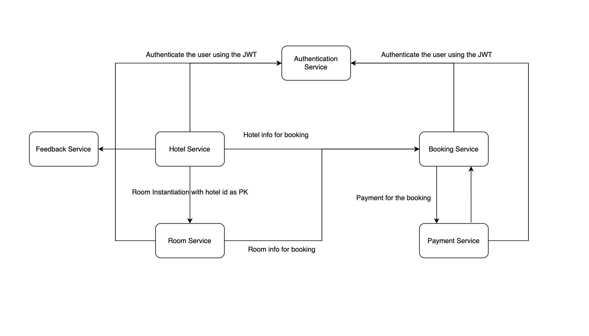
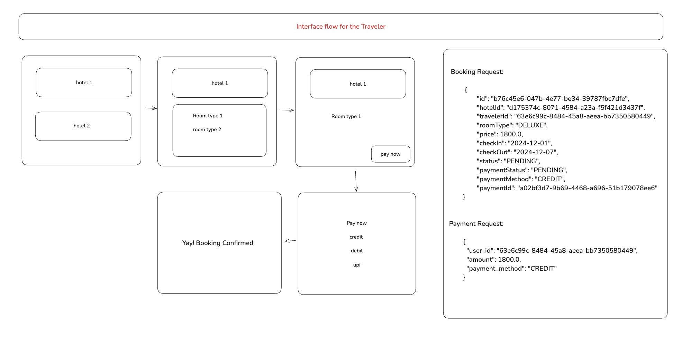

# Hotel-Booking-API

By,

*   GG Ashwin Prabhu
*   Sharan Kumar
*   Rimika Bhaumik
*   Sthuthi B
*   Harshvardhan Jaiswal

This project is a distributed system for managing hotel bookings, including services for authentication, payments, and feedback. Each service runs independently to ensure scalability and modularity.

##All the Endpoints in this API is built using REST principles

---
# Steps to run the API
1. run   `npm run start:auth` to start the auth service
2. run   `npm run start:payment` to start the payment service
2. run   `npm run start:feedback` to start the feedback service

[Link to SwaggerHub](https://app.swaggerhub.com/apis/ASHWINPRABHU2001/Hotel_Booking_API/1.0.0)

# Flow Diagram



# Traveller UI Diagram




# Use Case Diagram 


# Key Stakeholders
## 1. Traveler
## 2. Hotel Manager


# Auth Service Documentation

## Overview

The Auth Service provides endpoints for user registration, login, token verification, and user profile management.

## Endpoints

### 1. Register a New User

- **URL:** `/auth/register`
- **Method:** `POST`
- **Summary:** Register a new user.
- **Request Body:**
  ```json
  {
    "first_name": "string",
    "last_name": "string",
    "email": "string",
    "password": "string",
    "role": "TRAVELER | HOTEL_MANAGER"
  }
  ```
- **Responses:**
  - `201 Created`: User registered successfully.
  - `400 Bad Request`: Invalid input data.
  - `500 Internal Server Error`: Server error.

### 2. User Login

- **URL:** `/auth/login`
- **Method:** `POST`
- **Summary:** User login.
- **Request Body:**
  ```json
  {
    "email": "string",
    "password": "string"
  }
  ```
- **Responses:**
  - `200 OK`: Login successful, token returned.
   ```json
    {
      "token": string,
      "userId": "string"
    }
    ```
  - `400 Bad Request`: User not found or invalid credentials.
  - `500 Internal Server Error`: Server error.

### 3. Verify Authentication Token

- **URL:** `/auth/verify`
- **Method:** `POST`
- **Summary:** Verify authentication token.
- **Security:** Bearer Token
- **Responses:**
  - `200 OK`: Token is valid.
    ```json
    {
      "isValid": true,
      "userId": "string",
      "role": "string"
    }
    ```
  - `401 Unauthorized`: Invalid token.

### 4. Get User Profile

- **URL:** `/api/users/{user_id}`
- **Method:** `GET`
- **Summary:** Retrieve user profile by ID.
- **Security:** Bearer Token
- **Path Parameters:**
  - `user_id` (string): The ID of the user.
- **Responses:**
  - `200 OK`: User profile information.
  - `403 Forbidden`: Unauthorized access.
  - `404 Not Found`: User not found.
  - `500 Internal Server Error`: Server error.

### 5. Update User Profile

- **URL:** `/api/users/{user_id}`
- **Method:** `PUT`
- **Summary:** Update user profile information.
- **Security:** Bearer Token
- **Path Parameters:**
  - `user_id` (string): The ID of the user.
- **Request Body:**
  ```json
  {
    "first_name": "string",
    "last_name": "string",
    "password": "string"
  }
  ```
- **Responses:**
  - `200 OK`: Profile updated successfully.
  - `403 Forbidden`: Unauthorized access.
  - `404 Not Found`: User not found.
  - `500 Internal Server Error`: Server error.

## Authentication

All endpoints requiring user authentication use a Bearer Token passed in the `Authorization` header.

## Models

### User Object

```json
{
  "id": "string",
  "first_name": "string",
  "last_name": "string",
  "email": "string",
  "role": "TRAVELER | HOTEL_MANAGER",
  "createdAt": "string",
  "updatedAt": "string"
}
```

# User Endpoints

This section describes the User-related API endpoints.

## 1. Get User Profile

- **URL:** `/api/users/{user_id}`
- **Method:** `GET`
- **Description:** Retrieve user profile information by user ID.
- **Request Headers:**
  - `Authorization: Bearer <token>`
- **URL Parameters:**
  - `user_id` (string) - The ID of the user.
- **Security:** Bearer Authentication
- **Responses:**
  - `200 OK`
    - **Description:** User profile information.
    - **Response Body:**
      ```json
      {
        "id": "12345",
        "first_name": "John",
        "last_name": "Doe",
        "email": "john.doe@example.com",
        "role": "TRAVELER"
      }
      ```
  - `403 Forbidden`
    - **Description:** Unauthorized access.
  - `404 Not Found`
    - **Description:** User not found.
  - `500 Internal Server Error`
    - **Description:** Server error.

## 2. Update User Profile

- **URL:** `/api/users/{user_id}`
- **Method:** `PUT`
- **Description:** Update user profile information.
- **Request Headers:**
  - `Authorization: Bearer <token>`
  - `Content-Type: application/json`
- **URL Parameters:**
  - `user_id` (string) - The ID of the user.
- **Request Body:**
  - Example:
    ```json
    {
      "first_name": "John",
      "last_name": "Smith",
      "password": "newPassword123"
    }
    ```
- **Security:** Bearer Authentication
- **Responses:**
  - `200 OK`
    - **Description:** Profile updated successfully.
    - **Response Body:**
      ```json
      {
        "id": "12345",
        "first_name": "John",
        "last_name": "Smith",
        "email": "john.doe@example.com",
        "role": "TRAVELER"
      }
      ```
  - `403 Forbidden`
    - **Description:** Unauthorized access.
  - `404 Not Found`
    - **Description:** User not found.
  - `500 Internal Server Error`
    - **Description:** Server error.

## 3. Delete User Account

- **URL:** `/api/users/{user_id}`
- **Method:** `DELETE`
- **Description:** Delete a user account by user ID.
- **Request Headers:**
  - `Authorization: Bearer <token>`
- **URL Parameters:**
  - `user_id` (string) - The ID of the user.
- **Security:** Bearer Authentication
- **Responses:**
  - `200 OK`
    - **Description:** User deleted successfully.
    - **Response Body:**
      ```json
      {
        "message": "User deleted successfully"
      }
      ```
  - `403 Forbidden`
    - **Description:** Unauthorized access.
    - **Response Body:**
      ```json
      {
        "error": "Unauthorized access"
      }
      ```
  - `404 Not Found`
    - **Description:** User not found.
    - **Response Body:**
      ```json
      {
        "error": "User not found"
      }
      ```
  - `500 Internal Server Error`
    - **Description:** Server error.
    - **Response Body:**
      ```json
      {
        "error": "Server error"
      }
      ```


# Payment API Documentation

This Payment API is part of the Hotel Booking System, enabling payment management for bookings. The API supports operations like making payments, retrieving payment details, checking payment status, retrying failed payments, and more.

## Prerequisites

### Authentication & Authorization
All endpoints require an **Authorization token** in the `Authorization` header:
- Token format: `Bearer <JWT_TOKEN>`
- Tokens are validated using the `Auth Service`.

### Roles
Access is restricted based on user roles:
- **TRAVELER**: Regular user making payments.
- **HOTEL_MANAGER**: Administrator managing payments across the system.

---

## Endpoints
### 1. Retrieve a list of payments with optional filters.
### **GET /api/payments/**

**Required Token:**  
`TRAVELER` (only their payments) or `HOTEL_MANAGER` (any payment).

#### Query Parameters:
| Parameter    | Type     | Description                                                   |
|--------------|----------|---------------------------------------------------------------|
| `payment_id` | `string` | Filter by payment ID.                                         |
| `traveler_id`| `string` | Filter by traveler ID (HOTEL_MANAGER only).                   |
| `status`     | `string` | Filter by payment status (`IN_PROGRESS`, `FAILED`, `COMPLETED`). |
| `order_by`   | `string` | Order results by column (default: `created_at`).              |
| `order`      | `string` | Order direction (`ASC` or `DESC`, default: `ASC`).            |

---

### 2. Retrieve all payment statuses (HOTEL_MANAGER only).
### **GET /api/payments/status**

**Required Token:**  
`HOTEL_MANAGER`

#### Response:
- List of payments with `payment_id`, `traveler_id`, and `status`.

---

### 3. Make a new payment.
### **POST /api/payments/**

**Required Token:**  
`TRAVELER`

#### Request Body:
| Field           | Type     | Description                         |
|------------------|----------|-------------------------------------|
| `user_id`        | `string` | ID of the user making the payment.  |
| `amount`         | `number` | Payment amount (must be positive).  |
| `payment_method` | `string` | Payment method (`CREDIT` or `UPI`). |

---

### 4. Retrieve a specific payment by its ID.
### **GET /api/payments/:id**

**Required Token:**  
`TRAVELER` (only their payments) or `HOTEL_MANAGER` (any payment).

#### Path Parameters:
| Parameter | Type     | Description               |
|-----------|----------|---------------------------|
| `id`      | `string` | ID of the payment to fetch.|

---

### 5. Retrieve the status of a specific payment.
### **GET /api/payments/:id/status**

**Required Token:**  
`TRAVELER` (only their payments) or `HOTEL_MANAGER` (any payment).

#### Path Parameters:
| Parameter | Type     | Description               |
|-----------|----------|---------------------------|
| `id`      | `string` | ID of the payment to fetch.|

---

### 6. Retrieve all payments for a specific traveler.
### **GET /api/payments/traveler/:traveler_id**

**Required Token:**  
`TRAVELER` (only their payments) or `HOTEL_MANAGER` (any payment).

#### Path Parameters:
| Parameter     | Type     | Description                      |
|---------------|----------|----------------------------------|
| `traveler_id` | `string` | ID of the traveler to retrieve payments for.|

---

### 7. Retry a failed payment.
### **POST /api/payments/:id/retry**

**Required Token:**  
`TRAVELER`

#### Path Parameters:
| Parameter | Type     | Description                     |
|-----------|----------|---------------------------------|
| `id`      | `string` | ID of the payment to retry.     |

#### Notes:
- Only payments in `FAILED` status can be retried.

---

## Error Handling
- **401 Unauthorized:** Invalid or missing token.
- **403 Forbidden:** Insufficient permissions.
- **404 Not Found:** Resource not found.
- **500 Internal Server Error:** Unexpected server issue.

---

## Simulated Payment Processing
Payments initially have the status `IN_PROGRESS`. After a short delay, the status is updated to:
- `COMPLETED` (80% chance)
- `FAILED` (20% chance)


# Feedback API Documentation

# Overview 

The Feedback Service handles operations related to feedback for hotels, including adding, retrieving, and deleting feedback. The service enforces role-based access control, ensuring that only authorized users can perform specific actions.

# Authentication

All endpoints requiring user authentication use a Bearer Token passed in the `Authorization` header.

### Role-Based Access Control
- **TRAVELER**: Can add feedback for hotels.
                Can delete their own feedback.
- **HOTEL MANAGER**: Can delete any feedback for hotels.

## Models

### User Object

```json
{
  "id": "number",
  "hotel_id": "string",
  "traveler_id": "string",
  "comments": "string",
  "rating": "number",
  "createdAt": "string",
  "updatedAt": "string"
}
```
## Endpoints

### 1. Add Feedback

- **URL:** `/feedback`
- **Method:** `POST`
- **Summary:** Add feedback for a specific hotel. Only users with the role of TRAVELER can provide feedback..
- **Headers:**
    Authorization: Bearer <token>
    Content-Type: application/json
- **Request Body:**
  ```json
  {
    "hotel_id": "string",
    "traveler_id": "string",
    "comments": "string",
    "rating": "number"
  }
  ```
- **Responses:**
  - `201 Created`: Feedback added successfully.
  - `400 Bad Request`:  Feedback already exists for this traveler and hotel.
  - `403 Forbidden`: Only users with the role of TRAVELER can give feedback.
  - `404 Not Found`: Hotel not found.
  - `500 Internal Server Error`: Failed to add feedback.

### 2. Get Feedback for a Hotel

- **URL:** `/feedback/{hotel_id}`
- **Method:** `GET`
- **Summary:** Retrieve feedback for a specific hotel, with optional sorting.
- **Headers:**
    Authorization: Bearer <token>
- **Path Parameters:** 
   `hotel_id (string)`: The ID of the hotel.
- **Query Parameters (Optional):**
   `sort (string)`: Sort feedback by rating or date. Defaults to date.
   `order (string)`: Sort order, either asc or desc. Defaults to desc.

- **Responses:**
  - `201 OK`: Feedback retrieved successfully.
  - `201 OK`: No feedback available for this hotel.
  - `404 Not Found`: Hotel not found.
  - `500 Internal Server Error`: Server error.

### 3. Delete Feedback

- **URL:** `/feedback{id}`
- **Method:** `DELETE`
- **Summary:** Delete feedback by ID. Only HOTEL_MANAGER users can delete any feedback, while TRAVELER users can delete their own feedback.
- **Headers:**
    Authorization: Bearer <token>
- **Path Parameters:** 
   `id (number)`: The ID of the feedback.
- **Responses:**
  - `201 OK`: Feedback deleted successfully.
  - `403 Forbidden`: Unauthorized access.
  - `404 Not Found`: Feedback not found.
  - `500 Internal Server Error`: Failed to delete feedback.

# Hotel Service API Documentation

This API is part of the Hotel Management System, enabling management of hotel information such as creating, updating, fetching, and deleting hotel data. The API also provides a health check for the service status.

## Prerequisites

### Authentication & Authorization

All endpoints require an Authorization token in the Authorization header:

- Token format: `Bearer <JWT_TOKEN>`
- Tokens are validated using the Auth Service.

### Roles

Access is restricted based on user roles:

- **TRAVELER**: Regular user accessing hotel information.
- **HOTEL_MANAGER**: Administrator managing hotel data.
- **ADMIN**: Superuser with full access to all actions.

---

## Endpoints

### 1. Health Check
`GET /api/hotels/health`

Returns the status of the hotel service.

#### Response:

- `"Hotel service is up and running!"`

---

### 2. Create a Hotel
`POST /api/hotels`

Create a new hotel.

#### Required Token:
- `HOTEL_MANAGER` or `ADMIN`.

#### Request Body:
- `hotel`: Hotel details to create.

#### Response:
- Status: `201 Created`
- Body: `Hotel` object created.

---

### 3. Get All Hotels
`GET /api/hotels`

Retrieve a list of all hotels.

#### Required Token:
- `TRAVELER`, `HOTEL_MANAGER`, or `ADMIN`.

#### Response:
- Status: `200 OK`
- Body: List of `Hotel` objects.

---

### 4. Get Hotel by ID
`GET /api/hotels/{id}`

Retrieve a specific hotel by its ID.

#### Required Token:
- `TRAVELER`, `HOTEL_MANAGER`, or `ADMIN`.

#### Path Parameters:
- `id`: Hotel ID to retrieve.

#### Response:
- Status: `200 OK`
- Body: `Hotel` object for the specified ID.

---

### 5. Update Hotel
`PUT /api/hotels/{id}`

Update the details of an existing hotel.

#### Required Token:
- `HOTEL_MANAGER` or `ADMIN`.

#### Path Parameters:
- `id`: Hotel ID to update.

#### Request Body:
- `hotel`: Updated hotel details.

#### Response:
- Status: `200 OK`
- Body: Updated `Hotel` object.

---

### 6. Delete a Hotel
`DELETE /api/hotels/{id}`

Delete a specific hotel by its ID.

#### Required Token:
- `ADMIN`.

#### Path Parameters:
- `id`: Hotel ID to delete.

#### Response:
- Status: `200 OK`
- Body: `"Hotel deleted successfully"`

---

## Error Handling

- **401 Unauthorized**: Invalid or missing token.
- **403 Forbidden**: Insufficient permissions.
- **404 Not Found**: Resource not found.
- **500 Internal Server Error**: Unexpected server issue.

# Room Service API Documentation

This API is part of the Hotel Management System, enabling management of room-related operations for hotels, such as adding rooms, updating room types, and retrieving rooms based on hotel ID. The API also provides a health check for the service status.

## Prerequisites

### Authentication & Authorization

All endpoints require an Authorization token in the Authorization header:

- Token format: `Bearer <JWT_TOKEN>`
- Tokens are validated using the Auth Service.

### Roles

Access is restricted based on user roles:

- **TRAVELER**: Regular user accessing room information.
- **HOTEL_MANAGER**: Administrator managing room data.
- **ADMIN**: Superuser with full access to all actions.

---

## Endpoints

### 1. Health Check
`GET /api/rooms/health`

Returns the status of the room service.

#### Response:
- `"Room service is ready to serve!"`

---

### 2. Add a Room
`POST /api/rooms`

Add a new room to a hotel.

#### Required Token:
- `HOTEL_MANAGER` or `ADMIN`.

#### Request Body:
- `hotelId`: ID of the hotel where the room is to be added.
- `roomType`: Type of the room (e.g., Single, Double).

#### Response:
- Status: `200 OK`
- Body: `Room` object created.

---

### 3. Update Room Types by Hotel ID
`PUT /api/rooms/{hotelId}`

Update the types of rooms for a specific hotel.

#### Required Token:
- `HOTEL_MANAGER` or `ADMIN`.

#### Path Parameters:
- `hotelId`: ID of the hotel for which room types need to be updated.

#### Request Body:
- List of `RoomType` objects to update.

#### Response:
- Status: `200 OK`
- Body: Updated `Room` object (optional).

---

### 4. Get Rooms by Hotel ID
`GET /api/rooms/{hotelId}`

Retrieve a list of rooms for a specific hotel.

#### Required Token:
- `TRAVELER`, `HOTEL_MANAGER`, or `ADMIN`.

#### Path Parameters:
- `hotelId`: ID of the hotel to retrieve rooms for.

#### Response:
- Status: `200 OK`
- Body: List of `Room` objects.

---

## Error Handling

- **401 Unauthorized**: Invalid or missing token.
- **403 Forbidden**: Insufficient permissions.
- **404 Not Found**: Resource not found.
- **500 Internal Server Error**: Unexpected server issue.
- 

